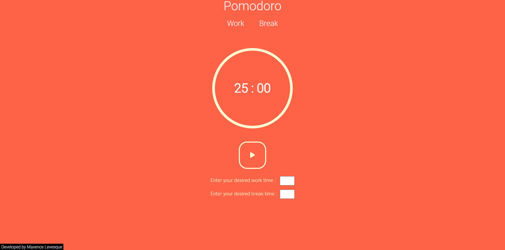

# Pomodoro Application 	:tomato:

## Details
This web application is based on the Pomodoro technique, a time management method that encourages productivity by alternating periods of work and rest. The application lets users define intervals of work and break time.

## Features :scroll:
- **Pomodoro Timer**: Start a timer according to a given time of work and of break.
- **Customization**: Customize the length of Pomodoro sessions and breaks to suit your preferences.
- **Saving Data**: Your time data will be stored in your local storage.

## Screenshot :camera_flash:

## Installation :desktop_computer:
1. Clone this repository : `git clone https://github.com/waylow1/Pomodoro.git`
2. Then go to the project directory : `cd Pomodoro`
3. You can also use it directly on my github page : `https://waylow1.github.io/Pomodoro/`

## Use
1. Config the length of your work session and your break session. 
2. Click on the button play to start the cycle
3. The screen will change color every time you switch from work to pause.
4. The more cycles you do the more productive you'll be 

## Author :writing_hand:
- By Maxence Levesque waylow1 on github
